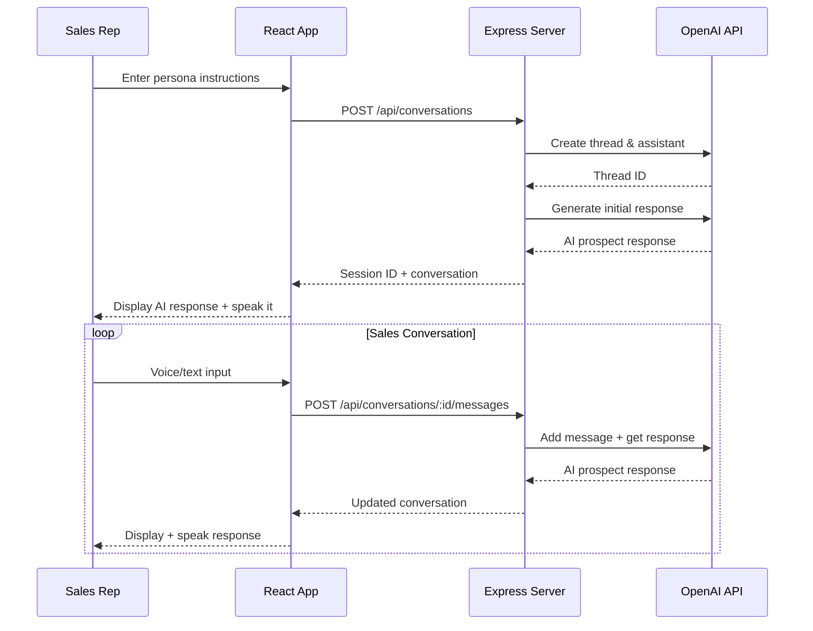

# AI Roleplays Sales Call Coach

## Overview

This is an AI-powered sales call coaching application that allows sales professionals to practice their skills through realistic roleplay scenarios. The application simulates sales conversations where users can interact with an AI prospect/buyer who responds realistically to sales pitches, asks relevant questions, and raises typical objections.

## Architecture & Approach

### System Architecture

The application follows a **client-server architecture** with the following components:

```
┌─────────────────┐    HTTP/WebSocket    ┌──────────────────┐    OpenAI API    ┌─────────────┐
│   React Client  │ ◄─────────────────► │  Express Server  │ ◄──────────────► │   OpenAI    │
│   (Frontend)    │                     │   (Backend)      │                  │  Assistant  │
└─────────────────┘                     └──────────────────┘                  └─────────────┘
```

### Key Approach Elements

1. **Persistent Conversations**: Uses OpenAI Threads API to maintain conversation context across sessions
2. **Session Management**: Each conversation is tracked with a unique session ID for state persistence
3. **Voice Integration**: Supports both voice input (speech-to-text) and voice output (text-to-speech)
4. **Real-time Interaction**: Real-time chat interface with immediate AI responses
5. **Persona-Based AI**: AI behavior can be customized based on initial persona instructions

## Technology Stack

### Backend Dependencies

| Library | Version | Purpose |
|---------|---------|---------|
| `express` | ^4.19.2 | Web server framework |
| `cors` | ^2.8.5 | Cross-origin resource sharing |
| `dotenv` | ^17.2.1 | Environment variable management |
| `openai` | ^5.10.2 | OpenAI API integration |
| `multer` | ^1.4.5-lts.1 | File upload handling |
| `pdf-parse` | ^1.1.1 | PDF document processing |

### Frontend Dependencies

| Library | Version | Purpose |
|---------|---------|---------|
| `react` | ^19.1.1 | Frontend framework |
| `react-dom` | ^19.1.1 | DOM rendering for React |
| `typescript` | ^4.9.5 | Type safety and development tooling |
| `tailwindcss` | ^3.4.17 | CSS framework for styling |
| `@heroicons/react` | ^2.2.0 | Icon library |
| `react-scripts` | 5.0.1 | Build tools and development server |

## How It Works

### 1. Session Initialization
```javascript
// User provides initial persona/behavior instructions
const result = await startConversation(initialText);
// Creates OpenAI thread and establishes session
```

### 2. Conversation Flow


### 3. Core Services

#### Backend Services

**aiReplyService.js**
- Manages OpenAI API communication
- Creates and manages conversation threads
- Runs AI assistant with persona instructions
- Uses GPT-4o model for realistic responses

**conversationService.js**
- Orchestrates conversation flow
- Handles session initialization and message processing
- Validates input and manages conversation state

**sessionService.js**
- Manages session persistence using OpenAI threads
- Stores persona/behavior instructions
- Tracks session metadata and activity

**validationService.js**
- Validates and sanitizes user input
- Ensures content safety and format compliance

#### Frontend Services

**apiService.ts**
- Centralized API communication layer
- TypeScript interfaces for type safety
- Handles all HTTP requests to backend

### 4. Voice Integration

**Speech Recognition (Input)**
```javascript
// Uses Web Speech API for voice input
const SpeechRecognition = window.SpeechRecognition || window.webkitSpeechRecognition;
const recognition = new SpeechRecognition();
recognition.onresult = (event) => {
    const transcript = event.results[0][0].transcript;
    // Process voice input
};
```

**Text-to-Speech (Output)**
```javascript
// Converts AI responses to speech
const utter = new SpeechSynthesisUtterance(aiResponse);
window.speechSynthesis.speak(utter);
```

### 5. Session Persistence

- **Local Storage**: Session IDs stored in browser localStorage
- **Session Recovery**: Automatic session restoration on page reload
- **Thread-based Storage**: Conversation history stored in OpenAI threads

## API Endpoints

### Conversation Management
- `POST /api/conversations` - Start new conversation
- `POST /api/conversations/:sessionId/messages` - Send message
- `GET /api/conversations/:sessionId` - Get conversation history
- `DELETE /api/conversations/:sessionId` - End conversation

### Legacy Support
- `POST /api/process-text` - Simple text processing
- `POST /instructions/openai` - Backward compatibility endpoint

## Environment Setup

### Required Environment Variables

```bash
# Backend (.env)
OPENAI_API_KEY=your_openai_api_key_here
OPENAI_ASSISTANT_ID=your_assistant_id_here  # Optional, will create if not provided
PORT=5000  # Optional, defaults to 5000

# Frontend (.env)
REACT_APP_API_URL=http://localhost:5000  # Optional, defaults to same origin
```

### Installation & Running

1. **Backend Setup**
```bash
cd AI-roleplays-sales-call-coach
npm install
npm start  # Runs on port 5000
```

2. **Frontend Setup**
```bash
cd frontend
npm install
npm start  # Runs on port 3000
```

## Key Features

### 🎭 **Realistic AI Personas**
- Customizable buyer personas based on user instructions
- Context-aware responses that maintain character consistency
- Professional yet challenging interactions mimicking real prospects

### 🎙️ **Voice Integration**
- **Speech-to-Text**: Practice natural speaking patterns
- **Text-to-Speech**: Hear realistic prospect responses
- **Hands-free Operation**: Focus on conversation flow

### 💾 **Session Persistence**
- Conversations automatically saved and restored
- Pick up where you left off across browser sessions
- Full conversation history tracking

### 🔄 **Real-time Interaction**
- Immediate AI responses to maintain conversation flow
- Live typing indicators and loading states
- Seamless conversation experience

### 🛡️ **Input Validation**
- Content safety and sanitization
- Error handling and graceful degradation
- User-friendly error messages

## Development Architecture

### State Management
- React hooks for local state management
- Session persistence via localStorage
- Real-time updates through API calls

### Error Handling
- Comprehensive error catching and user feedback
- Graceful degradation for unsupported features
- Network error recovery

### Performance Optimization
- Efficient API calls with proper loading states
- Minimal re-renders through proper state structure
- Voice API management to prevent conflicts

## Future Enhancements

- Integration with CRM systems
- Call recording and analysis
- Performance metrics and coaching insights
- Multi-language support
- Advanced AI coaching feedback

---

This application provides sales professionals with a safe, realistic environment to practice and improve their sales conversation skills through AI-powered roleplay scenarios.